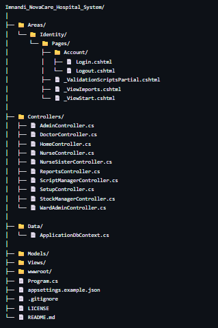

# 🏥 Imnandi NovaCare Hospital System

> **Streamlining Healthcare Operations Through Integrated Digital Management**

An integrated hospital management platform designed to streamline patient care, clinical operations, ward administration, medication management, inventory control, and hospital-wide resource management.

---

## 👤 Author

**Cyahman Ahmed**

Developed as an integrated hospital management platform demonstrating practical application of web development, database management, authentication, role-based access control, healthcare workflows, inventory management, reporting, and system administration.

---

## 📌 Overview

The **Imnandi NovaCare Hospital System** is a modern, web-based hospital management platform developed to centralize and optimize key healthcare workflows within a single, secure environment.

---

## 🛠️ Technology Stack

| Category | Technologies |
| :--- | :--- |
| **Backend Framework** | C#, .NET, ASP.NET Core MVC, ASP.NET Core Identity |
| **Database & ORM** | Microsoft SQL Server, Entity Framework Core, EF Core Migrations |
| **Frontend Architecture** | HTML5, CSS3, JavaScript, Razor Views, Bootstrap |
| **Core Capabilities** | PDF Generation Engine, Role-Based Access Control (RBAC), AI Integration |
| **Tooling & Version Control** | Git, GitHub |

---

## ⚡ Key Features

### 👤 Patient Management
* **Patient Registration & Management:** Full digital registration and profile administration.
* **Patient Information Management:** Centralized record-keeping for demographics and personal data.
* **Patient Admission & Discharge:** Streamlined admission intake and discharge processing.
* **Ward & Bed Allocation:** Direct room and bed assignment upon admission.
* **Inter-Departmental Transfers:** Patient transfers between departments and healthcare professionals.
* **Patient Status Tracking:** Real-time visibility into patient care status.
* **Centralized Patient Records:** Single source of truth for historical and active patient records.

### 🏥 Ward Administration
* **Ward, Room & Bed Management:** Comprehensive management of hospital wards, rooms, and individual bed availability.
* **Admissions, Discharges & Transfers:** Operational workflow handling for patient movements within wards.
* **Ward Activity Management:** Oversight of day-to-day ward-level operational tasks.
* **Ward-Specific Stock Management:** Tracking stock levels allocated directly to specific wards.
* **Department-Based Access:** Enforced access boundaries based on ward assignments.

### 👨‍⚕️ Doctor and Clinical Management
* **Doctor-Patient Workflow:** End-to-end clinical care management.
* **Patient Assessment & Consultations:** Consultation tracking, examination logs, and clinical assessment management.
* **Treatment Planning:** Long-term and immediate patient care plan creation.
* **Prescription & Medication Instructions:** Electronic prescription issuing with precise dosage instructions.
* **Patient Treatment Records:** Centralized historical treatment logging.
* **Doctor Visit Scheduling:** Scheduled ward rounds and consultation appointments.
* **Clinical Collaboration Workflows:** Direct communication and handover channels between doctors and nursing staff.

### 👩‍⚕️ Nursing Management
* **Nurse Management & Department Workflows:** Dedicated task execution interfaces tailored to nursing units.
* **Nurse Assignments:** Task and patient assignment for individual nursing staff.
* **Nursing Sister / Supervisor Functionality:** Advanced oversight and approval capabilities for senior nursing personnel.
* **Patient Treatment & Medication Administration:** Execution, tracking, and logging of administered treatments and drugs.
* **Ward-Level Patient Care:** Operational management of daily bed-side care activities.

### 💊 Medication and Prescription Management
* **Medication Management:** Full cataloging and tracking of hospital medications.
* **Prescription Lifecycle:** Creation, status tracking, and validation of electronic prescriptions.
* **Dosage & Stock Monitoring:** Real-time checking of script dosages against current stock levels.
* **Script Management & Dispensing:** Streamlined workflow from doctor script creation to pharmacy dispensing.
* **Ward Medication Distribution:** Controlled transfer of dispensed drugs to ward stock.
* **Medication Stock Transactions:** Detailed audit trail of all drug movements.

### 🩺 Consumables Management
* **Consumable Item Management:** Cataloging and monitoring of non-medication medical supplies.
* **Stock Ordering & Receiving:** Requisition generation, purchase receiving, and inventory intake.
* **Stock Transfers & Department Allocation:** Controlled transfer of consumables between stores and wards.
* **Supplier Management:** Vendor profiles, purchasing history, and supplier directory.
* **Stock Transaction History & Monitoring:** Real-time threshold tracking and historical movement logs.

### 📦 Hospital Stores and Pharmacy
* **Medical Stores & Pharmacy Operations:** Integrated management of central stores and outpatient/inpatient pharmacy facilities.
* **Combined Stock Management:** Centralized oversight for both medication and consumable stock.
* **Purchase Orders & Order Processing:** Standardized purchase order creation, approval, receiving, and allocation.
* **Stock Take Functionality:** Audited stock counts, adjustments, and reconciliation workflows.
* **Transaction Tracking:** Full traceability for all store-to-ward allocations.

### 👔 Centralized Stock Management
* **Role-Based Stock Managers:** Dedicated interfaces for stock managers across relevant departments.
* **Ordering, Processing & Receiving:** Complete inventory lifecycle management.
* **Stock Adjustments & Transfers:** Managed inventory corrections, wastage tracking, and inter-unit transfers.
* **Stock Takes & History:** Periodic inventory audits and historical reporting.
* **Multi-Level Level Monitoring:** Real-time stock alerts from central stores down to ward-level supply rooms.

### 🛡️ Administration and User Management
* **Role-Based Access Control (RBAC):** Granular authorization models ensuring controlled access to specific hospital modules.
* **Authentication & User Types:** Secure login protocols supporting multiple user roles (Doctors, Nurses, Pharmacists, Admins, Stock Managers).
* **User Management:** Administrator tools for user creation, role assignment, and password resets.
* **Primary Administrator Bootstrap:** 
  * The first administrator account created during initial system setup automatically becomes the **Primary Administrator**.
  * The primary administrator establishes the initial organizational structure and provisions secondary administrative accounts.
  * Authorized administrators subsequently manage users according to their assigned permissions.
> **⚠️ Important Security Note:** Initial administrator credentials must be stored securely and must **never** be committed to public source control.

### 📊 Reporting
* **Hospital Management Reports:** High-level executive and operational dashboards.
* **Medication & Stock Reports:** Dedicated reporting on inventory levels, usage rates, and stock take audits.
* **Departmental & Transaction History:** Detailed audit trails of departmental activity and stock movements.
* **PDF Report Generation:** Built-in engine for exporting structured operational and clinical reports to PDF format.

### 🔔 Alerts and Notifications
* **Operational Event Alerts:** Automated system notifications to help authorized users identify critical operational events, low stock thresholds, and workflow updates in real time.

### 🔍 Audit Functionality
* **System Activity Tracking:** Comprehensive event logging across critical system operations and data modifications.
* **Accountability & Governance:** Audit logs provide total transparency, helping administrators inspect system usage and historical changes.

### 🤖 AI Assistant
* **Conversational Homepage Assistant:** Embedded AI tool on the landing page providing an interactive, conversational interface for users to query the system and navigate features.

---

## 👥 User Roles and Departments

The system supports multiple user roles, each assigned tailored permissions to enforce proper operational boundaries and departmental segregation.

| Role / Area | Primary Responsibilities |
| :--- | :--- |
| **Main Administrator** | Global system administration, initial system bootstrap, user management, and role assignment. |
| **Administrator** | General administrative management and authorized secondary user creation. |
| **Ward Administrator** | Patient admissions, discharges, ward oversight, and room/bed allocation. |
| **Doctor** | Clinical patient assessment, treatment planning, and issuing prescriptions. |
| **Nurse** | Daily bedside patient care, treatment execution, and medication administration. |
| **Nursing Sister** | Supervisory oversight of nursing staff, shift workflows, and ward-level nursing management. |
| **Script Manager** | Prescription review, verification processing, and medication dispensing coordination. |
| **Stock Manager** | Oversight of medication and consumable inventory levels, stock takes, and transfers. |
| **Hospital Stores** | Inventory intake, stock receiving, central storage, and inter-departmental distribution. |
| **Hospital Pharmacy** | Comprehensive medication stock management, script processing, and direct dispensing. |
| **Other Departments** | Specialized department-specific operational workflows and modular access. |

---

## 📂 Project Structure
## System Workflow



---

## 🚀 Getting Started & Local Setup

Follow these steps to set up and run the **Imnandi NovaCare Hospital System** on your local machine.

### 1. Clone the Repository
Clone the repository using Git and open the solution in **Visual Studio**:

git clone [https://github.com/cyahmanahmed/Imnandi_NovaCare_Hospital_System.git](https://github.com/cyahmanahmed/Imnandi_NovaCare_Hospital_System.git)

### 2. Restore Dependencies

Visual Studio should automatically restore the project's NuGet packages. You can also restore them using:

dotnet restore

### 3. Configure SQL Server

The application requires a SQL Server database. Create a local SQL Server instance using either:

* **SQL Server Developer Edition**
* **SQL Server Express**
* Another compatible SQL Server installation

You can create a database manually or allow Entity Framework Core to create it through migrations.

### 4. Configure the Database Connection

The repository does not contain the real `appsettings.json` configuration because database credentials and connection information should not be committed to source control.

Create your local `appsettings.json` inside:

Imnandi_NovaCare_Hospital_System/

### 5. Create the Database Using Entity Framework Core

After configuring the connection string, open the Visual Studio Package Manager Console and run:

Add-Migration Migration_Name
Update-Database

### 6. Run the Application

In Visual Studio, select the appropriate project profile and press:

* **`F5`** (with debugging)
* **`Ctrl + F5`** (without debugging)

The application should launch in your configured web browser.

### 7. Initial Administrator Setup

On the first installation, the system creates the initial administrator according to the application's administrator setup process.

* The first administrator is the **Primary Administrator** and should be treated as the main administrative account for the system.
* The primary administrator is responsible for creating the initial user structure, including additional administrators and other authorized hospital users.
* After the initial setup, authorized administrators can create and manage users according to their permissions.

> **⚠️ Important Security Note:** The initial administrator login details are critical. Store them securely and **never** commit them to GitHub or place them inside source code. If the administrator password is forgotten, use the application's password reset/recovery process where available.

---

## 🛠️ Development Practices

The project follows a structured and maintainable development approach utilizing best practices:

* **Version Control:** Git for source control and GitHub for repository management.
* **Feature-Based Development:** Modular structure supporting clear feature isolation and iterative enhancement.
* **Database Management:** Entity Framework Core migrations for robust, code-first database schema evolution.
* **Security & Access:** Granular role-based authorization and secure, non-committed configuration management (`appsettings.json`).
* **Architectural Pattern:** Strict separation of concerns using the ASP.NET Core MVC pattern (Controllers, Models, Views, and ViewModels).
* **Enterprise Workflows:** Database-driven business logic accompanied by full audit logging and activity tracking.

---

## 🎯 Project Goals

The system is designed to provide a centralized platform that connects hospital departments and improves the flow of information throughout the patient journey. Key goals include:

* **Automate Workflows:** Reduce manual administrative processes across all operational levels.
* **Optimize Care Delivery:** Improve overall patient and ward management efficiency.
* **Enhance Collaboration:** Improve coordination and clinical communication between doctors and nursing staff.
* **Streamline Prescriptions:** Simplify prescription creation, script tracking, and medication handling.
* **Increase Stock Visibility:** Improve real-time tracking of medications and consumable inventory.
* **Bridge Departmental Silos:** Foster seamless inter-departmental communication and data transfer.
* **Data-Driven Insights:** Provide structured reporting for operational and managerial oversight.
* **Maintain Governance:** Improve accountability through system-wide audit logging.
* **Enforce Security:** Provide controlled, role-based access based on user responsibilities.
* **Single Source of Truth:** Centralize hospital operational and clinical information into one unified platform.

---

## 📄 License

## License

This project is licensed under the **MIT License**.

```text 
MIT License

Copyright (c) 2026 Cyahman Ahmed
